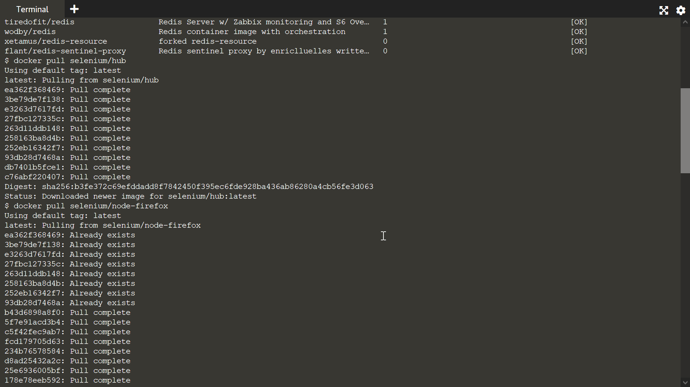
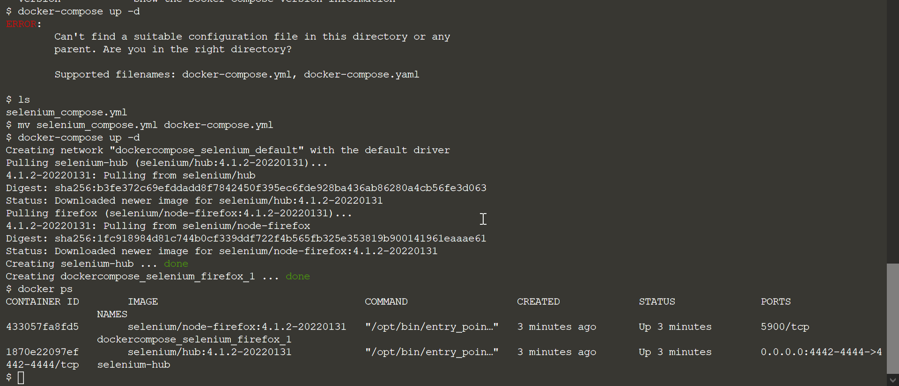

# Creating Selenium hub using Docker compose

1. Pull the required docker images into your docker container
2. Create a compose file with information about the docker images to be used, dependencies and environments.
3. Use the command ``` docker-compose up -d ``` . It would create the selenium hub using the information you wrote in your compose file



